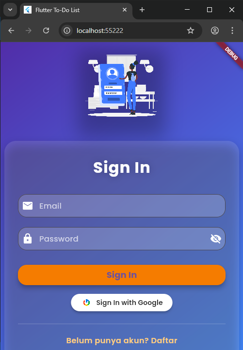
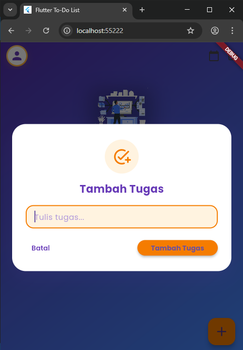
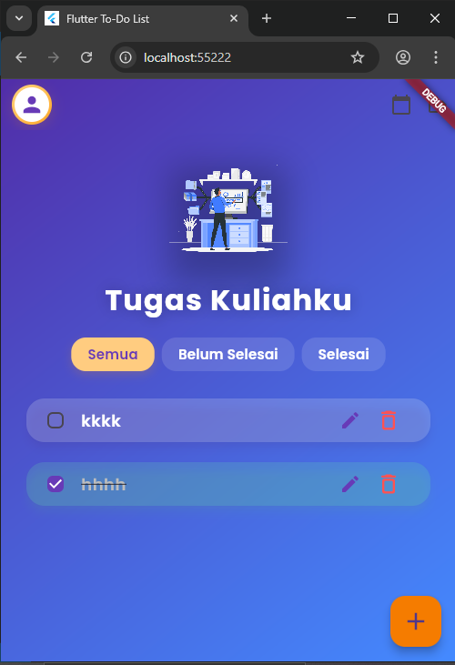
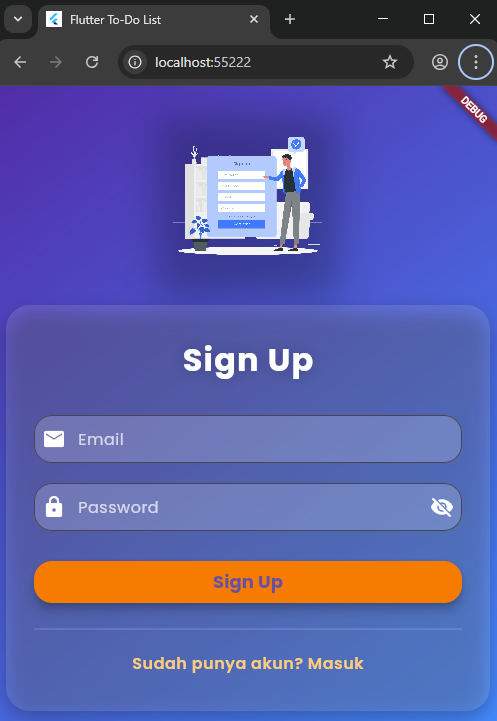

# prak_dbs

**Nama:** Alifian Putra Naidi  
**NIM:** 2390343011  
**Kelas:** RJ23A

---

## 📌 Getting Started

### 🎯 Judul Proyek
**TodoApps**

### 📝 Deskripsi Fungsionalitas
Aplikasi ini bertujuan untuk mengorganisir semua tugas kuliah, baik tugas yang sudah selesai maupun yang belum selesai.

### 🔧 Teknologi yang Digunakan
- **Firebase** sebagai datastore.

### 🚀 Cara Menjalankan Aplikasi
1. Pengguna pertama kali masuk ke **halaman login**.
2. Jika belum memiliki akun, pengguna akan diarahkan ke **halaman daftar akun (sign up)**.
3. Setelah login berhasil, pengguna dapat mulai mengelola daftar tugas.

---

## 📸 Screenshots

| Tampilan | Gambar |
|----------|--------|
| **Login Page** |  |
| **Halaman Baru** |  |
| **Halaman Navigasi** |  |
| **Sign Up Page** |  |
| **Welcome Page** |  |

---

